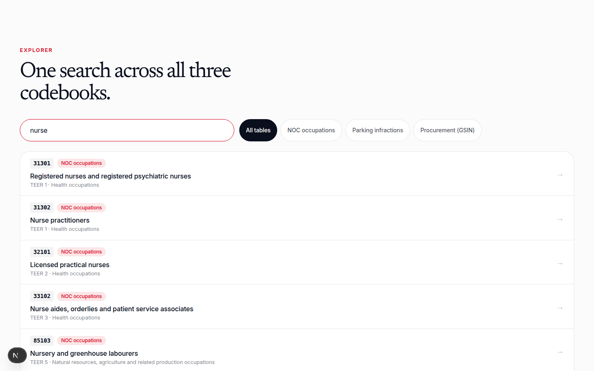
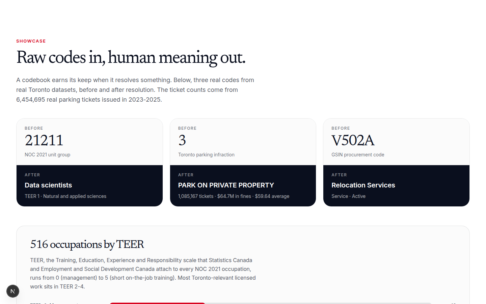

# toronto-civic-codebooks

Reference tables that resolve Toronto's civic codes to human meaning. Part of [Nshipyard Canada](https://canada.nshipyard.com). An open-source civic project, not affiliated with the Government of Canada or the City of Toronto.

Toronto's civic datasets speak in codes: a 5-digit number for an occupation, a 3-digit infraction for a parking ticket, an alphanumeric string for a procurement line. Without the reference tables, those columns are opaque. This repo publishes three of them, compiled from authoritative sources, searchable through one interface, one REST API, and MCP tools.

## The three tables

| File | Rows | Contents |
|---|---|---|
| `data/noc_2021.csv` | 516 | NOC 2021 V1.0 unit groups: code, English and French titles, TEER category, broad category |
| `data/infraction_codebook.csv` | 195 | Toronto parking infraction codes: description, ticket count, total fines, average fine |
| `data/procurement_codes.csv` | 4,909 | GSIN procurement codes: English and French descriptions, status, commodity type |

NOC is the National Occupational Classification, the system Statistics Canada and Employment and Social Development Canada use to classify every occupation in the Canadian economy. TEER is the Training, Education, Experience and Responsibility scale (0 = management, 5 = short on-the-job training), encoded in the second digit of each 5-digit NOC code. GSIN is the Goods and Services Identification Number, the code Public Services and Procurement Canada uses to identify what the federal government buys.

## Screenshots





## Methodology

- **NOC**: titles are verbatim from Statistics Canada's NOC 2021 V1.0 classification structure files (English and French, retrieved 2026-10-08). TEER is derived from the second digit of the 5-digit code, per StatCan's documented structure. TEER category labels in the app are short paraphrases, documented in `src/i18n.tsx`.
- **Infractions**: descriptions are verbatim from the City of Toronto parking tickets file. Ticket counts, total fines, and average fines are computed from 6,454,695 real tickets issued in 2023-2025, in the sibling project `toronto-parking-tickets-geocoded`.
- **Procurement**: descriptions are verbatim from Public Services and Procurement Canada's GSIN list (retrieved 2026-10-08). The commodity type (Goods/Service/Construction) is derived from the code pattern per the federal reporting guide. The City of Toronto publishes no commodity-code reference table in open data, so the federal GSIN is the documented fallback for procurement codes.
- Raw source downloads are kept in `data/raw/` for reproducibility and are not committed.

## API

REST base: `/api/v1/codes`

- `GET /api/v1/codes/search?q=nurse&table=noc` - unified search across all three codebooks
- `GET /api/v1/codes/noc?q=&teer=` - list NOC occupations, optional TEER filter (0-5)
- `GET /api/v1/codes/noc/21211` - one occupation
- `GET /api/v1/codes/infractions?q=` - list infraction codes
- `GET /api/v1/codes/infractions/3` - one infraction with ticket totals
- `GET /api/v1/codes/procurement?q=&type=` - list GSIN codes, optional type filter
- `GET /api/v1/codes/procurement/V502A` - one GSIN code
- `GET /api/v1/codes/summary` - table counts, sources, methodology notes
- `GET /api/openapi.json` - OpenAPI 3.1 spec

MCP (streamable HTTP): `POST /mcp` with tools `codes_lookup` and `codes_search`. The Developers section on the site has copy-paste setup prompts for ChatGPT, Claude, Claude Code, and CLI harnesses.

## Develop

```bash
npm install
npm run dev
```

## License

MIT. Source tables are © their publishers (Statistics Canada, City of Toronto, Public Services and Procurement Canada); the compilation is original work.

## Author

**Richardson Dackam** - [X (@richardsondx)](https://x.com/richardsondx) · [GitHub](https://github.com/richardsondx)
